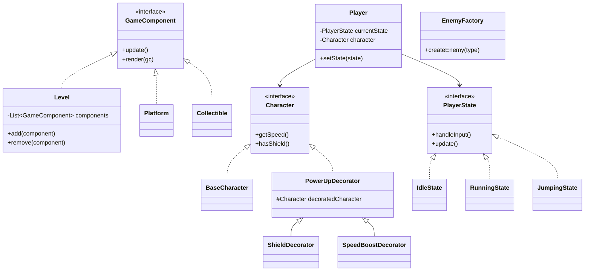

# Mini Super Mario - Design Patterns Project

## Description
A classic platformer game developed in JavaFX, demonstrating the practical application of 4+ design patterns. The project features a fully animated hero, diverse enemies, interactive obstacles, and a real-time logging system for traceability of all game events.

## Membres du Groupe
- **Antigravity AI** (Lead Developer)
- **User** (Lead Architect)

## Technologies Utilisées
- **Langage** : Java 17
- **Framework GUI** : JavaFX
- **Logging** : Log4j2
- **Audio** : Java Sound API (Procedural)
- **Build** : Maven

## Design Patterns Implémentés

### 1. State Pattern (Obligatory)
- **Game States** : Gestion des transitions entre `Menu`, `Playing`, `Pause`, `GameOver`, et `Victory`.
- **Player States** : États comportementaux du héros (`Idle`, `Running`, `Jumping`, `Attacking`, `Dead`).
- *Traceability* : Chaque transition est enregistrée dans le log avec le tag `[STATE]`.

### 2. Decorator Pattern (Obligatory)
- **Power-ups** : Ajout dynamique de capacités au personnage via des décorateurs :
    - `ShieldDecorator` : Protection contre un coup.
    - `SpeedBoostDecorator` : Augmentation de la vitesse.
    - `WeaponDecorator` : Permet d'éliminer les monstres au contact.
    - `DoubleJumpDecorator` : Permet de sauter une deuxième fois en l'air.
    - `InvincibilityDecorator` : Immunité temporaire.
- *Traceability* : Application et retrait des décorateurs tracés via `[DECORATOR]`.

### 3. Composite Pattern (Obligatoire)
- **Structure des Niveaux** : Le niveau (`Level`) agit comme un Composite pouvant contenir divers `GameComponent` (Plateformes, Collectibles, Obstacles).
- Permet une gestion unifiée du rendu et de la mise à jour de tous les éléments du niveau.

### 4. Factory Pattern (Additionnel)
- **Enemy Factory** : Création centralisée des différents types d'ennemis (`Goomba`, `Koopa`, `FlyingEnemy`, `Shooter`) avec leurs comportements spécifiques.

### 5. Singleton Pattern (Additionnel)
- **Game Manager** : Instance unique gérant le cycle de vie du jeu et la synchronisation des données.

## Project Structure

```
com.miniplatformer/
├── Main.java                          # JavaFX application entry point
├── config/
│   ├── GameConfig.java                # Game constants and settings
│   └── LoggingConfig.java             # Log4j2 configuration
├── engine/
│   ├── GameManager.java               # Singleton game manager
│   ├── GameLoop.java                  # Main game loop
│   ├── InputHandler.java              # Keyboard/mouse input
│   └── CollisionSystem.java           # Collision detection
├── patterns/
│   ├── state/
│   │   ├── GameState.java             # Game state interface
│   │   ├── MenuState.java
│   │   ├── PlayingState.java
│   │   ├── PauseState.java
│   │   ├── GameOverState.java
│   │   ├── VictoryState.java
│   │   ├── PlayerState.java           # Player state interface
│   │   ├── IdleState.java
│   │   ├── RunningState.java
│   │   ├── JumpingState.java
│   │   ├── AttackingState.java
│   │   └── DeadState.java
│   ├── decorator/
│   │   ├── Character.java             # Character interface
│   │   ├── BaseCharacter.java         # Base player implementation
│   │   ├── PowerUpDecorator.java      # Abstract decorator
│   │   ├── SpeedBoostDecorator.java
│   │   ├── ShieldDecorator.java
│   │   ├── WeaponDecorator.java
│   │   ├── DoubleJumpDecorator.java
│   │   └── InvincibilityDecorator.java
│   ├── composite/
│   │   ├── GameComponent.java        # Component interface
│   │   ├── Level.java                 # Composite (level)
│   │   └── Platform.java              # Leaf (platform)
│   └── factory/
│       ├── Enemy.java                 # Enemy interface
│       ├── EnemyFactory.java          # Enemy factory
│       ├── Goomba.java
│       ├── Koopa.java
│       └── FlyingEnemy.java
├── entities/
│   ├── Entity.java                  # Base entity class
│   ├── Player.java                  # Player entity
│   ├── EnemyEntity.java             # Enemy entity
│   └── Position.java                # Position/velocity class
├── ui/
│   ├── MainView.java                  # Main JavaFX view
│   ├── MenuView.java                  # Menu screen
│   ├── GameView.java                  # Game screen
│   ├── HUD.java                       # Heads-up display
│   └── screens/
│       ├── PauseView.java
│       ├── GameOverView.java
│       └── VictoryView.java
├── resources/
│   ├── images/                        # Sprites and graphics
│   ├── sounds/                        # Sound effects and music
│   └── levels/                       # Level configuration files
├── systems/
│   ├── CollisionSystem.java           # Collision detection and combat logic
│   └── SoundSystem.java               # Procedural audio generation
├── utils/
│   ├── GameLogger.java                # Multi-channel logging utility
│   └── AssetLoader.java               # Asset loading utility
```

## UML Class Diagram


## Installation
### Prérequis
- JDK 17 ou supérieur
- Maven 3.6+

### Étapes
1. Cloner le dépôt.
2. Compiler le projet :
   ```bash
   mvn clean install
   ```
3. Exécuter le jeu :
   ```bash
   mvn javafx:run
   ```

## Utilisation
- **Flèches directionnelles** : Déplacement gauche/droite.
- **Espace** : Saut.
- **Esc** : Pause / Retour au menu.
- **Weapon (Auto)** : Si l'arme est équipée, toucher un monstre l'élimine.

## Structure du Projet
- `com.miniplatformer.core` : GameManager et boucles de jeu.
- `com.miniplatformer.patterns` : Implémentations des Design Patterns.
- `com.miniplatformer.entities` : Entités du jeu (Joueur, Projectiles).
- `com.miniplatformer.systems` : Systèmes denses (Collision, Audio).
- `com.miniplatformer.ui` : Interface JavaFX et HUD.
- `logs/game.log` : Fichier de traçabilité généré en temps réel.
